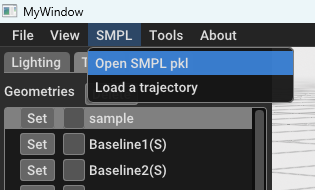
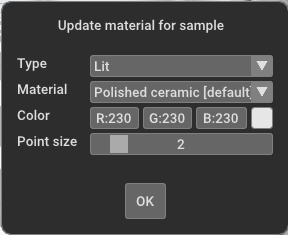

SMPL Sequences and Scene Visualization Tool

===========================

[](https://github.com/isl-org/Open3D/actions?query=workflow%3A%22Ubuntu+CI%22)
[](https://github.com/isl-org/Open3D/actions?query=workflow%3A%22macOS+CI%22)
[](https://github.com/isl-org/Open3D/actions?query=workflow%3A%22Windows+CI%22)

This is a powerful open-source GUI tool designed to quickly and accurately visualize and **compare SMPL sequences** in large scenes in real-time. Based on Open3D, this tool can be easily run cross platforms and on CPU-only computers. However, if you require more advanced rendering capabilities, we recommend using Blender, Unity, or similar software for optimal results.

## Features
- Fast and accurate visualization of SMPL sequences in real-time **using only SMPL parameters**
- Comparison of SMPL results across different sequences and scenes
- Visualizing complex scenes and large datasets
- Open-source and customizabl
- CPU-only compatible
- Cross-platform compatible


## Requirements
1. Open3D 15.0+
2. Download the SMPL model `basicModel_neutral_lbs_10_207_0_v1.0.0.pkl`, `basicModel_f_lbs_10_207_0_v1.0.0.pkl`, `basicModel_m_lbs_10_207_0_v1.0.0.pkl` and `J_regressor_extra.npy` from http://smpl.is.tue.mpg.de and put them in `smpl` directory.
2. (Optional) `ffmpeg` for video processing

## Installation  
1. Clone the repository:
```
git clone https://github.com/climbingdaily/SMPL-Viewer.git
```
2. Install the required packages:
```
conda create --name sviewer python==3.9 -y
conda activate sviewer
pip install numpy open3d matplotlib scipy opencv-python torch torchvision torchaudio paramiko chumpy lzf 
```
3. Run
```
python GUI_Tool.py
```

## Usage

 - Launch the tool.
 - Select the SMPL sequences ([Demo](imgs/smpl_sample.pkl)) you wish to visualize and compare.
 - Use the GUI controls to adjust the view, lighting, and other rendering parameters.
 - Compare the SMPL results across different sequences and scenes.

| # | Function | Button |
|---|---|----
| 1 |`.pcd` `.ply` `.obj` `.xyz` `.xyzn` visualization | 
| 2 |`.pcd` sequence visualization | 
| 3 | SMPL sequence (`.pkl`) visualization <br> The data structure is detailed at [readme](gui_vis/readme.md)  | 
| 4 | Geometry's material editing |  
| 5 | Camera load/save |  
<!-- | 6 | Rendering and generating the video (with camera automatically saved). <br> - **Start**: Toggle on the `Render img` <br> - **End**: Click the `Save video` <br> - The video will automatically be saved when the play bar meets the end.  |   -->
   

## Todos

- [x] Save the video with GUI
- [x] Add shade, HDR map ...
- [x] Load video
- [x] Generate / save camera trajectetory
- [ ] Save the video with headless mode

## Contributing
Contributions are welcome and encouraged! If you find a bug or have an idea for a new feature, please open an issue or submit a pull request.

## License
The codebase is licensed under the Creative Commons Attribution-NonCommercial-ShareAlike 3.0 License. You must attribute the work in the manner specified by the authors, you may not use this work for commercial purposes and if you alter, transform, or build upon this work, you may distribute the resulting work only under the same license. 

## Contact
If you have any questions or comments about the project, please contact me at yudidai@stu.xmu.edu.com.

## Acknowledgments
We would like to thank the following individuals for their contributions to this project:

- Lin Xiping, Lin Yitai and Yan Ming for providing valuable feedback and suggestions during development
- The [Open3D](http://www.open3d.org/) development team for their excellent library that powers this tool.
- ChatGPT for providing assistance with refining the project description and other suggestions, including this readme file.
- The creators of SMPL for their groundbreaking work in creating a widely-used and versatile body model.

We are also grateful to the broader open-source community for creating and sharing tools and knowledge that make projects like this possible.

## Citation
This project is driven by the need for LiDAR-based Human and scene motion capture. If you find this tool useful for your own work, please consider citing the corresponding paper that inspired this project:
``` bash
@InProceedings{Dai_2022_CVPR,
    author    = {Dai, Yudi and Lin, Yitai and Wen, Chenglu and Shen, Siqi and Xu, Lan and Yu, Jingyi and Ma, Yuexin and Wang, Cheng},
    title     = {HSC4D: Human-Centered 4D Scene Capture in Large-Scale Indoor-Outdoor Space Using Wearable IMUs and LiDAR},
    booktitle = {Proceedings of the IEEE/CVF Conference on Computer Vision and Pattern Recognition (CVPR)},
    month     = {June},
    year      = {2022},
    pages     = {6792-6802}

@inproceedings{dai2023sloper4d,
    title     = {SLOPER4D: A Scene-Aware Dataset for Global 4D Human Pose Estimation in Urban Environments},
    author    = {Dai, Yudi and Lin, YiTai and Lin, XiPing and Wen, Chenglu and Xu, Lan and Yi, Hongwei and Shen, Siqi and Ma, Yuexin and Wang, Cheng},
    booktitle = {IEEE Conference on Computer Vision and Pattern Recognition (CVPR)},
    month     = {June},
    year      = {2023}
}
}

```